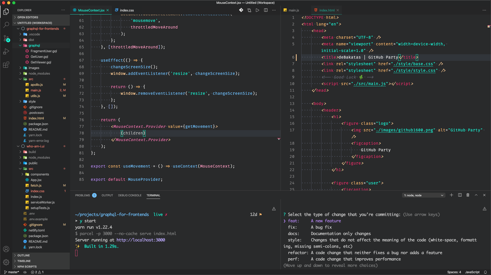

# Nikodermus uses

This is a small guide for setting my mac into development, useful GUI and CLI apps, files, articles and tips to do it right from scratch.
[Check out the video](https://www.youtube.com/watch?v=wiXjXwx1P4c) (**Spanish**) with a more in-depth explanation:

## 

## Articles

| Link                                                                                                                         | Why                                                                                                                 | Autor                                                     |
| ---------------------------------------------------------------------------------------------------------------------------- | ------------------------------------------------------------------------------------------------------------------- | --------------------------------------------------------- |
| [macOS Setup](http://sourabhbajaj.com/mac-setup/Contributors.html)                                                           | This guide covers the basics of setting up a development environment on a new Mac.                                  |  [@sb2nov](https://github.com/sb2nov)                     |
| [GitHub Accounts with SSH keys](https://www.freecodecamp.org/news/manage-multiple-github-accounts-the-ssh-way-2dadc30ccaca/) | The need to manage multiple GitHub accounts on the same machine comes up at some point in time for most developers. |  [Bivil M Jacob](https://www.linkedin.com/in/bivilmjacob) |

---

## GUI Apps

|                                                          Download                                                           | App                       | Why                                                                       | brew                        |
| :-------------------------------------------------------------------------------------------------------------------------: | :------------------------ | :------------------------------------------------------------------------ | :-------------------------- |
|                                                 | Adobe Xd                  | UI Design and web assets creation.                                        | -                           |
|                                                                 | Alfred                    | Spotlight replacement.                                                    | `alfred`                    |
|                        | Android File Transfer     | Transfer files from Android to Mac.                                       | `android-file-transfer`     |
|                                                | AppCleaner                | Remove Apps and orphan files.                                             | `app-cleaner`               |
|  | Commander One             | FTP, SFTP with double panel view.                                         | `commander-one`             |
|                                                         | Docker                    | Isolate applications in containers.                                       | `docker`                    |
|                       | Firefox Developer Edition | Main Browser for use/development.                                         | `firefox-developer-edition` |
|                                                      | Google Chrome             | Side development browser, used to check compatibility.                    | `google-chrome-dev`         |
|                                                                               | Kap                       | Video Screenshot Recorder.                                                | `kap`                       |
|                                                                          | OBS                       | Screen Recorder and Streaming Client.                                     | `obs`                       |
|                                                                 | Postman                   | API Client for REST, SOAP and GraphQL.                                    | `postman`                   |
|                                                            | Rectangle                 | Move and resize windows in macOS using keyboard shortcuts or snap areas.  | `rectangle`                 |
|                                                          | Rocket                    | Emoji provider inside any app.                                            | -                           |
|                                                                           | Slack                     | Communication between teams.                                              | `slack`                     |
|                                                              | Spotify                   | Premium music service.                                                    | `spotify`                   |
|                                          | The Unarchiver            | Uncompress RAR, TGZ and other formats not natively supported.             | `the-unarchiver`            |
|                                                    | Transmission              | Torrent client.                                                           | `transmission`              |
|                                                       | True Key                  | Password, secrets and document manager.                                   | -                           |
|                                                | Visual Studio Code        | Code Editor and Integrated Terminal.                                      | `visual-studio-code`        |
|                                                                    | VLC                       | Cross-platform multimedia player and video conversor.                     | `vlc`                       |
|                                             | VPN Unlimited             | Premium VPN Service.                                                      | -                           |
|                                                                         | Zeplin                    | Share, organize and collaborate on designs—built with developers in mind. | `zeplin`                    |
|                                                       | Zoom                      | Video Meeting and Screen Share app.                                       | `zoomus`                    |

---

## ZSH Terminal

| Util                                                                                                             | Why                                                                                                                              |
| :--------------------------------------------------------------------------------------------------------------- | :------------------------------------------------------------------------------------------------------------------------------- |
| [OhMyZsh](https://ohmyz.sh/)                                                                                     | A delightful, open source, community-driven framework for managing your Zsh configuration.                                       |
| [avit-da2k](https://github.com/fdaciuk/avit-da2k)                                                                | oh-my-zsh theme based on avit theme.                                                                                             |
| [zsh-autosuggestions](https://github.com/zsh-users/zsh-autosuggestions/blob/master/INSTALL.md)                   | It suggests commands as you type based on history and completions.                                                               |
| [zsh-completions](https://github.com/zsh-users/zsh-completions#oh-my-zsh)                                        | This projects aims at gathering/developing new completion scripts that are not available in Zsh yet.                             |
| [zsh-syntax-highlighting](https://github.com/zsh-users/zsh-syntax-highlighting/blob/master/INSTALL.md#oh-my-zsh) | Enables highlighting of commands whilst they are typed at a zsh prompt into an interactive terminal.                             |
| [zsh-nvm](https://github.com/lukechilds/zsh-nvm#as-an-oh-my-zsh-custom-plugin)                                   | The plugin will install the latest stable release of nvm if you don't already have it, and then automatically source it for you. |

---

## Visual Studio Code

I use [Panda Syntax](https://marketplace.visualstudio.com/items?itemName=tinkertrain.theme-panda) for my theme, with [Fira Code](https://github.com/tonsky/FiraCode/wiki/Installing) as my monospace font with [material](https://marketplace.visualstudio.com/items?itemName=PKief.material-icon-theme) icons. Check out my [settings file](/vscode.json) :)

### VSCode Plugins

> 🔥 Hot Tip: When I install a plugin, I global disable it and only enable it in projects (workspaces) where I need it. For example: in a React project, I enable the React related plugins. This keeps suggestions and performance at it best.

### Global Plugins

| Download                                                                                                       | Why                                                                        |
| :------------------------------------------------------------------------------------------------------------- | :------------------------------------------------------------------------- |
| [deBakatas Pack](https://marketplace.visualstudio.com/items?itemName=nikodermus.debakatas-extensionpack)       |  **My recommendation of plugins for every JS developer**.                  |
| [Bash Beautify](https://marketplace.visualstudio.com/items?itemName=shakram02.bash-beautify)                   |  Format / Beautify bash and shell scripts.                                 |
| [Bracket Pair Colorizer](https://marketplace.visualstudio.com/items?itemName=CoenraadS.bracket-pair-colorizer) |  A customizable extension for colorizing matching brackets.                |
| [Code Runner](https://marketplace.visualstudio.com/items?itemName=formulahendry.code-runner)                   |  Run programming files directly and see the output below..                 |
| [CodeSnap](https://marketplace.visualstudio.com/items?itemName=adpyke.codesnap)                                |  Take beautiful screenshots of your code.                                  |
| [ColorHighlight](https://marketplace.visualstudio.com/items?itemName=naumovs.color-highlight)                  |  Highlight web colors in your editor.                                      |
| [EditorConfig](https://marketplace.visualstudio.com/items?itemName=EditorConfig.EditorConfig)                  |  EditorConfig Support for Visual Studio Code.                              |
| [ESLint](https://marketplace.visualstudio.com/items?itemName=dbaeumer.vscode-eslint)                           |  Integrates ESLint JavaScript into VS Code.                                |
| [GitHistory](https://marketplace.visualstudio.com/items?itemName=donjayamanne.githistory)                      |  View git log, file history, compare branches or commits.                  |
| [Kite](https://www.kite.com/download/)                                                                         |  AI-powered coding assistant featuring line-of-code Python and JavaScript. |
| [Prettier](https://marketplace.visualstudio.com/items?itemName=esbenp.prettier-vscode)                         |  Code formatter using prettier.                                            |

### Language Plugins

| Download                                                                                                              | Why                                                           | Language  |
| :-------------------------------------------------------------------------------------------------------------------- | :------------------------------------------------------------ | :-------- |
| [Simple React Snippets](https://marketplace.visualstudio.com/items?itemName=burkeholland.simple-react-snippets)       |  Dead simple React snippets you will actually use.            | `react`   |
| [vscode-styled-components](https://marketplace.visualstudio.com/items?itemName=jpoissonnier.vscode-styled-components) |  Syntax highlighting for styled-components.                   | `react`   |
| [React PropTypes Generate](https://marketplace.visualstudio.com/items?itemName=suming.react-proptypes-generate)       |  Auto generate react's propTypes.                             | `react`   |
| [Vetur](https://marketplace.visualstudio.com/items?itemName=octref.vetur)                                             |  Vue tooling for VS Code.                                     | `vue`     |
| [vue](https://marketplace.visualstudio.com/items?itemName=jcbuisson.vue)                                              |  Syntax Highlight for Vue.js.                                 | `vue`     |
| [language-stylus](https://marketplace.visualstudio.com/items?itemName=sysoev.language-stylus)                         |  Stylus language support.                                     | `stylus`  |
| [Manta's Stylus Supremacy](https://marketplace.visualstudio.com/items?itemName=thisismanta.stylus-supremacy)          |  Format your Stylus files with ease.                          | `stylus`  |
| [Sass](https://marketplace.visualstudio.com/items?itemName=Syler.sass-indented)                                       |  Indented Sass syntax Highlighting, Autocomplete & Formatter. | `sass`    |
| [postcss-sugarss-language](https://marketplace.visualstudio.com/items?itemName=mhmadhamster.postcss-language)         |  postcss and sugarss syntax support.                          | `postcss` |

---

## Global NPM Packages

| Name                                                                   |  Why                                                                                                           |
| :--------------------------------------------------------------------- | :------------------------------------------------------------------------------------------------------------- |
| [@vue/cli](https://cli.vuejs.org/guide/installation.html)              | Creation and edition of Vue projects.                                                                          |
| [commitizen](https://www.npmjs.com/package/commitizen)                 | Create standard and better commit messages.                                                                    |
| [create-react-app](https://create-react-app.dev/)                      | Set up a modern React web app by running one command.                                                          |
| [eslint-config-wesbos](https://github.com/wesbos/eslint-config-wesbos) | No-Sweat™ Eslint and Prettier Setup.                                                                           |
| [gatsby-cli](https://www.gatsbyjs.com/docs/gatsby-cli/)                | React-based open source framework for creating websites and apps.                                              |
| [prettier](https://prettier.io/)                                       | Opinionated code formatter.                                                                                    |
| [yarn](https://classic.yarnpkg.com/lang/en/)                           | Fast, reliable, and secure dependency management. (_Yes, I install `yarn` as a global NPM package, fight me._) |
